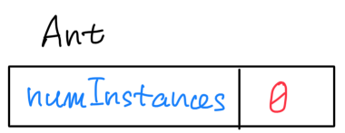
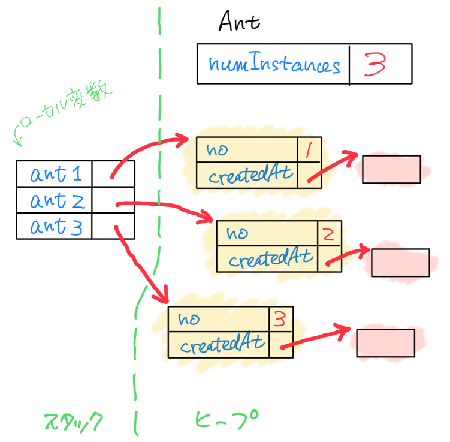

# StaticSandのメモリイメージ

## クラス定義

`Ant`クラスを定義した時点で、`static`な`numInstances`用の領域が確保される。

このあと、`Ant`インスタンスが何個生成されようとも、この領域は1つだけ。

## メソッド呼び出し

`run()`メソッドを呼ぶと、その中で、3つの`Ant`インスタンスを生成する。生成後のメモリの様子は以下の通り。

黄色で塗ったのが、`Ant`インスタンス。各インスタンスは`no`と`createdAt`というフィールドを持つ。`createdAt`が指す先には`LocalDateTime`インスタンス(ピンクの塗りつぶし)がある。`LocalDateTime`インスタンスの内部は謎なので詳しくは描いてない。

`ant1`や`ant2`といったローカル変数用の領域は、「スタック」と呼ばれるエリアに配置される。一方、`new`されたインスタンス用の領域は、「ヒープ」と呼ばれるエリアに配置される。
